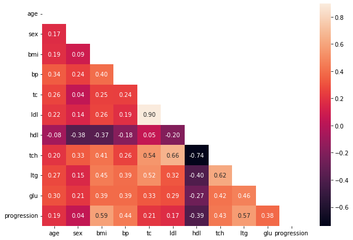
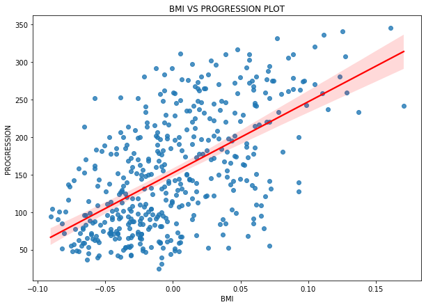
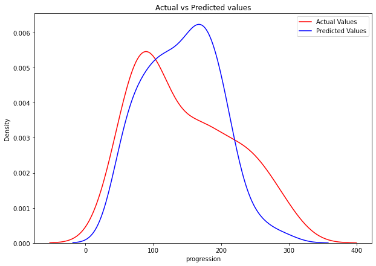
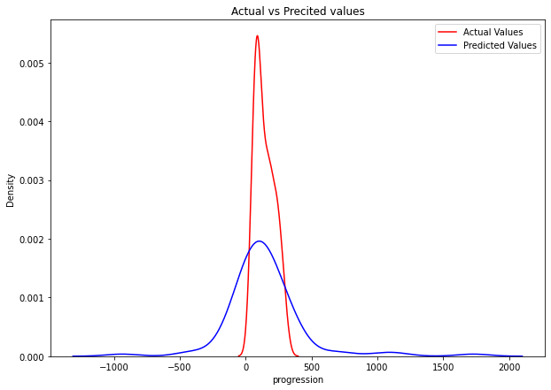
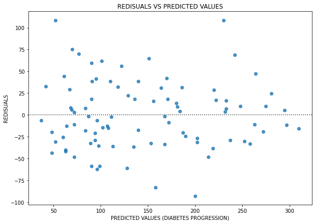

# Predicting Diabetes Progression with Machine Learning

This project implements a complete machine learning pipeline to predict diabetes progression based on physiological variables. It transition from an exploratory Jupyter Notebook to a modular, production-ready Python codebase.

## 📊 Project Overview

The objective is to model the relationship between ten baseline variables (age, sex, body mass index, average blood pressure, and six blood serum measurements) and a quantitative measure of disease progression one year after baseline.

## 📂 Project Structure

```text
├── custom_functions/       # Shared plotting utilities
│   └── plots.py            # Custom visualization functions
├── ouputs/                 # Generated visualizations and models
│   ├── correlation.png     # Feature correlation heatmap
│   ├── bmi_progression.png # BMI vs Progression analysis
│   ├── actualVSpredict.png # Model prediction accuracy
│   └── ...                 # Preprocessed data and saved models
├── scripts/                # Modular Python scripts
│   ├── eda.py              # Exploratory Data Analysis
│   ├── preprocess.py       # Data cleaning and scaling
│   ├── model.py            # Model training and evaluation
│   └── fine_tuning.py      # Hyperparameter optimization
├── diabetes_predictions.ipynb # Original experimental notebook
└── requirements.txt        # Project dependencies
```

## 🔍 Exploratory Data Analysis (EDA)

The initial phase involved understanding feature distributions and correlations.

### Feature Correlation
The correlation heatmap reveals which baseline variables have the strongest relationship with disease progression.


### Key Insights: BMI vs Progression
Body Mass Index (BMI) shows a significant positive correlation with diabetes progression.


## 🛠️ Data Preprocessing

Data is validated for missing values, split into training (80%) and testing (20%) sets, and normalized using `StandardScaler` to ensure optimal model performance.

## 🤖 Modeling & Evaluation

The project evaluates several regression algorithms to identify the best predictor.

### Linear & Regularized Regression
Standard Linear Regression and Lasso profiles provide a baseline for prediction.


### Polynomial Regression (Degree 3)
To capture non-linear relationships, Polynomial features were explored. While showing high training accuracy, it demonstrated significant overfitting on the test set.


### Residual Analysis
Residual plots are used to verify the assumptions of the regression models and identify patterns in prediction errors.


## 🚀 How to Run the Pipeline

1. **Setup Environment**:
   ```bash
   pip install -r requirements.txt
   ```

2. **Run Analysis**:
   ```bash
   # Perform EDA
   python scripts/eda.py
   
   # Preprocess Data
   python scripts/preprocess.py
   
   # Train Models
   python scripts/model.py
   ```

3. **Hyperparameter Tuning**:
   ```bash
   python scripts/fine_tuning.py
   ```

## 📈 Conclusion
The modular scripts provide a robust framework for diabetes prediction, allowing for easy experimentation with new features and models beyond the initial notebook exploration.
